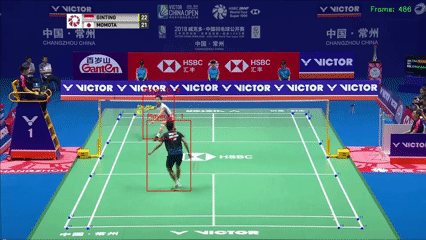
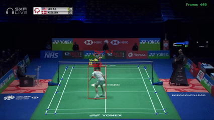

# Badminton Tracking & Analysis

A computer vision pipeline for tracking players, the shuttle, and court geometry in badminton match footage, built around YOLO11 and an object-oriented tracking architecture.

**Status:** Work in progress — core detection/tracking pipeline is functional

## Demo

F | MS | Anthony Sinisuka GINTING (INA) vs Kento MOMOTA (JPN) [3] | BWF 2018


YONEX All England Open 2021 | Day 5: Lee Zii Jia (MAS) [6] vs Viktor Axelsen (DEN) [2]



## Overview

This project applies YOLO11-based object and pose detection to badminton match video to enable automated match analysis. It combines three detection tasks — player tracking, shuttle tracking, and court keypoint detection — into a single OOP pipeline, using each component's output (e.g., court geometry) to constrain and improve the others (e.g., filtering player detections to valid in-bounds regions).

## What it does

- **Player Tracking** (`Tracking/player_tracker.py`): Detects and tracks players frame-to-frame using a pretrained YOLO11x model combined with ByteTrack/BoTSORT for identity persistence across frames.
- **Shuttle Tracking** (`Tracking/shuttle_tracker.py`): Detects the shuttle using a custom-trained YOLO11s model (trained on a merged dataset of ~25k images from Roboflow), with highest-confidence-only detection and interpolation to handle fast motion and occlusion.
- **Court Detection** (`Court_line_detect/court_detector.py`): Detects 18 court keypoints via a custom-trained YOLO11s-pose model, used to establish court boundaries and reference lines (net position, service lines, doubles sidelines).
- **Player Filtering**: Uses court keypoints to filter out detections outside the playing area — leveraging net-post and service-line reference points plus a minimum bounding-box height threshold to reduce false positives (e.g., spectators, officials).

## Architecture

The pipeline is organized around three main classes:

- `PlayerTracker` — player detection and multi-object tracking
- `ShuttleTracker` — shuttle detection with temporal interpolation
- `CourtDetector` — court keypoint detection and geometric reference extraction

Detection results are cached to disk (stub files) to avoid recomputation during iterative development.

## Tech Stack

- **Detection/Pose Models:** YOLO11s, YOLO11s-pose, YOLO11x (Ultralytics)
- **Tracking:** ByteTrack, BoTSORT
- **Core Libraries:** PyTorch, OpenCV
- **Training:** Custom-trained on a merged Roboflow dataset (~25k images) for shuttle detection; custom court keypoint dataset (18 keypoints, trained at imgsz=640)

## Project Structure

```
├── Tracking/              # Player and shuttle tracking modules
├── Court_line_detect/     # Court keypoint detection module
├── utils/                 # Shared utility functions (bbox, video I/O)
├── main.py                # Pipeline entry point
├── YOLO_training.py       # Model training script
├── keypointtraining.py    # Court keypoint model training script
├── KeyPointTRAIN.ipynb    # Court keypoint training notebook
└── roboyolotests.ipynb    # Shuttle detection dataset/model experiments
```

## Motivation

Started as a personal project combining a background in computer vision and data pipeline engineering with an interest in badminton, and used as a hands-on way to build practical experience with PyTorch, CNNs, and object detection architectures.

## Planned Improvements

- [ ] Rally segmentation/ statistics and shot classification
- [ ] Improved shuttle tracking robustness during fast exchanges

## Notes

This is an actively evolving personal project — some scripts and notebooks reflect earlier experimentation and will be cleaned up over time.
